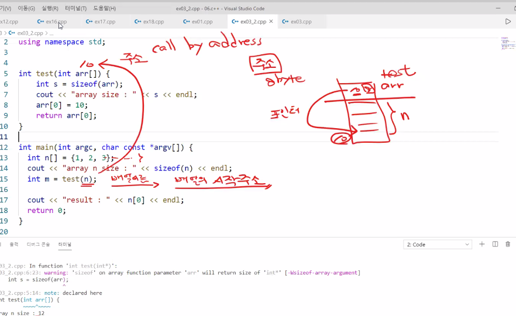
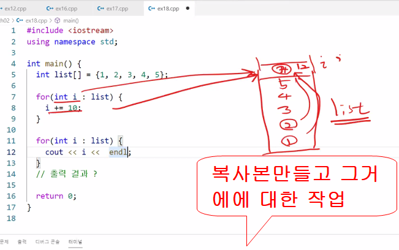
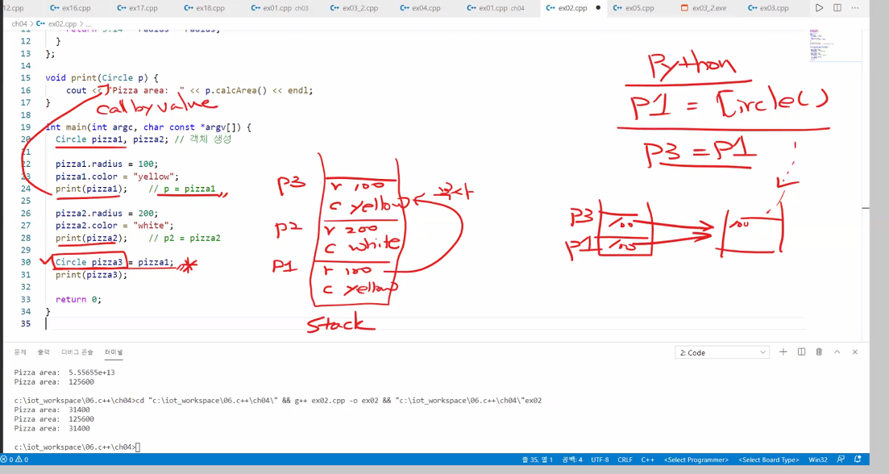
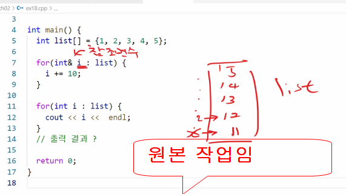

# 3. 함수와 문자열

- 함수의 구조
- int타입 max함수이름(int x, int y  매개변수)

- 위치기반  키워드 전달이 아님

- 변수 함수 상수 식별자는 사용하기 전 반드시 선언되어야 함

- 리턴 타입이 없을때 void를 쓴다.
- int func(int n)   만 해줘서 함수의 모양만 잡을 수 있다!

```c++
#include <iostream>
using namespace std;

int max(int x, int y) {
	if(x>y)
		return x;
	else
		return y;
}

int main(int argc, char const *argv[]) {
	int n;
	n = max(2, 3);
	cout << "함수 호출 결과 : " << n << endl;
	return 0;
}
```


- **함수 인자 전달방법**
  - **call by value  : 값 복사본(새로운 주소에 value할당), 원본에 영향 x**
  - **call by reference**
  - **call by address(pointer) : 기존 주소가져와서 값 변경**

- call by reference 함수예제

```c++
#include <iostream>
using namespace std;

void swap(int& x, int &y){   // 함수에서 !! 리턴값이 없을때 void 타입을써줌 
    int t;
    t = x;
    x = y;
    y = t;
}

int main(){
    int a =100, b=200;

    printf("a=%d, b=%d\n", a, b);
    swap(a, b);
    printf("a=%d, b=%d\n", a, b);
    return 0;
}
```










- **overload 함수**
  - **함수의 이름은 동일하지만 함수의 인자가 다르면 다른 함수로 인식**
  - 리턴 타입은 상관 없음

```c++
#include <iostream>
using namespace std;

int square(int i){
    cout << "square(int) 호출"<< endl;
    return i*i;
}

double square(double i){
    cout <<"square(double)호출" <<endl;
    return i*i;
}

int main(int argc, char const *argv[]){
    cout << square(10) << endl;
    cout << square(2.33) << endl;
    return 0;
}
```


- 인수의 디폴트값을 지정한 함수
  - 뒤에서 부터 배정한다
  - 앞에서 부터 배정하는 경우 에러
  - ex) int print( double a = 0.0 , int prec )  이면 에러가 발생 prec가 앞에 와야!

```c++
#include <iostream>
using namespace std;

void display(char c=' * ',int n =10){
    for(int i=0; i < n; i++){
        cout << c;

    }
    cout << endl;
}

int main(int argc, char const *argv[]){
    display();
    display('#'); // 하나짜린 애러난다
    display('#', 5);
    return 0;
}
```


## 2 ) 문자열

- string 클래스

  - 문자열 데이터 저장 및 문자열 처리 함수(메서드) 제공

  - #include <string>을 먼저 지정후 사용

  - | 멤버함수           | 설명                                                       |
    | ------------------ | ---------------------------------------------------------- |
    | s[i]               | i 번째 원소                                                |
    | s.empty()          | s가 비어있으면 true반환                                    |
    | s.insert(pos, s2)  | s의 pos 위치에 s2를 삽입                                   |
    | s.remove(pos, len) | s의 pos위치에 len만큼을 삭제                               |
    | s.find(s2)         | s에서 문자열 s2가 발견되는 첫번째 인덱스를 반환            |
    | s.find(pos, s2)    | s의 pos 위치부터 문자열 s2가 발견되는 첫번째 인덱스르 반환 |

    

```c++
#include <iostream>
#include <string>
using namespace std;

int main(int argc, char const *argv[]){
    string s = "When in Rome, do as the Romes.";

    int size = s.size();
    int index = s.find("Rome");

    cout << size << endl;
    cout << index << endl;

    return 0;
}
```

```c++
#include <iostream>
#include <string>

using namespace std;

int main(int argc, char const *argv[])
{
    string s ="When in Rome, do as the Romans.";

    for(auto& ch:s){
        cout << ch << ' ';   // Char 타입임  char에 따라 1개씩 끊어서 보여줌
    }
    
    return 0;
}
```

