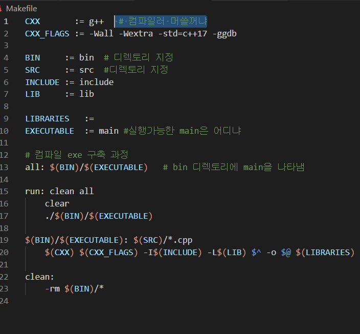

# 4.1 다중 파일을 위한 프로젝트 관리

- 기본적으로 클래스의 상속으로부터 시작된다.

Car.hpp  -----> Car.cpp  ------> Car.obj    ------(위)

​				-----> main.cpp ------> main.obj   ------ (아래) 이까지온위아래가 linking됨 make로 makefile																							이 해주며 xxx.exe 를 만들어준다


Taxi.hpp  --> 과정 똑같게 해서 Car를 상속받는 인스턴스를 만들 수 있음


- 패키지 모듈 구성 후 생성된 파일 보면

  - .vscode : vscode 설정
  - bin : 컴파일 결과 저장 (실행파일) xxx.exe
  - include : 헤더 파일  file.hpp
  - lib  : 외부 라이브러리
  - src : cpp 파일 소스
  - Makefile : 컴파일 규칙 정의

  

- makefile에서 설정 의미




- 파일 실제 구성 소스
- Car.hpp

```c++
#include <string>
using namespace std;


// Car 클래스 signature(원형) 껍데기를 만들어줌
class Car {
    int speed;  // 속도
    int gear;   // 기어
    string color;   // 색상
public:
    int getSpeed();
    void setSpeed(int s);
};
```

- Car.cpp

```c++
#include <iostream>
#include "Car.hpp"

void Car::setSpeed(int s){
    speed = s;

}

int Car::getSpeed(){
    return speed;

}
```

- main.cpp

```c++
#include<iostream>
#include<string>
#include "Car.hpp"

using namespace std;

int main(){
    Car myCar;

    myCar.setSpeed(100);

    cout <<"speed :" << myCar.getSpeed() << endl;

    return 0; 
}

```


-----

- Car를 상속받는 Taxi 인스턴스 만들기

- Taxi.hpp

```c++
#pragma once

#include "Car.hpp"
class Taxi : public Car {
protected:
    int fee;

public:
    void setFee(int f);
    int getFee();

};
```

- Taxi.cpp

```c++
#include "Taxi.hpp"

void Taxi::setFee(int f){
    fee = f;
}

int Taxi::getFee(){
    return fee;
}
```

이땐 main.cpp  안만들어도 된다.