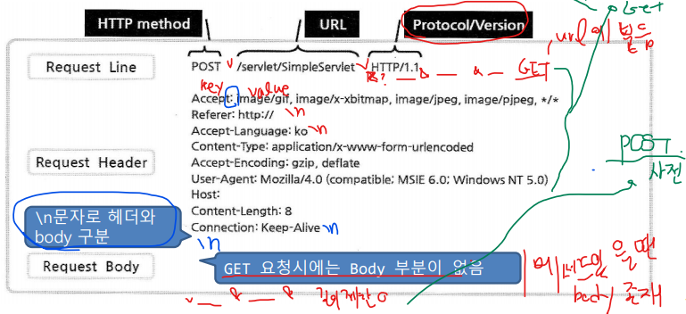
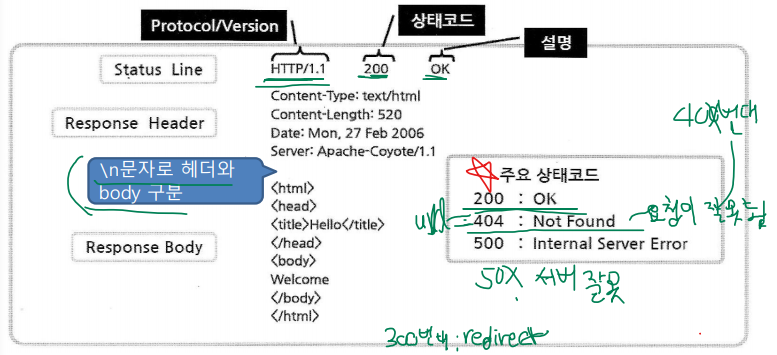
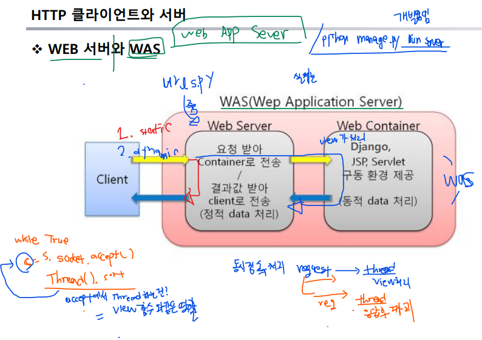
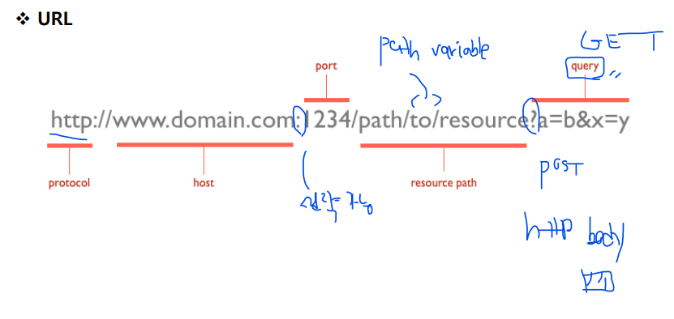

# 0. HTTP 프로토콜

- 주요특징

  - 문자 기반 프로토콜

  - 디폴트로 80 포트 사용

  - 클라이언트가 서버로 요청을 보내면 서버는 요청 내용을 클라이언트로 응답 후 접속 해제

    ----> 서버 측에서 접속에 대한 상태 유지하지 않는다 : **stateless**

  - 이후 접속 시에 누구인지, 이전에 어떤 작업르 했는지에 대하 상태 정보 없음

- HttpClient(브라우저) -----------요청(request)------->>-- HttpServer(웹 서버)

- HttpClient(브라우저) ----<<----응답(request)----------- HttpServer(웹 서버)

총 4단계로 구성됨

- 1. **Connect / 2. request / 3. response / 4. close**

**HTTP Request**

- 요청라인(Request Line)
  - http 메서드 방식 및 요청 URL과 프로토콜 정보 ( 1줄로 표현)
- 요청 헤더(Request Header)
  - 웹 브라우저 정보, 언어 ,인코딩 방식, 요청 서버정보 등 추가 정보  (항목 N개)
- 요청 본체(Request body)
  - 요청에 필요한 내용

- view함수는 request head로 다 간다.

**HTTP Response**

- 상태 라인
  - 응답 상태 코드 및 프로토콜 정보
- 응답 헤더
  - 응답 처리 날짜, 인코딩 방식, 요청 서버 정보 등 같은 추가 정보
- 응답 본체
  - 응답에 필요한 내용. 일반적으로 HTML문서 
- 오류는 200번대(ok), 300번대(redirect문제), 400번대(url요청이 잘못됨), 500번대(Internal Sever 에러)

**WEB 서버와 WAS (Web App server)**

**URL**

