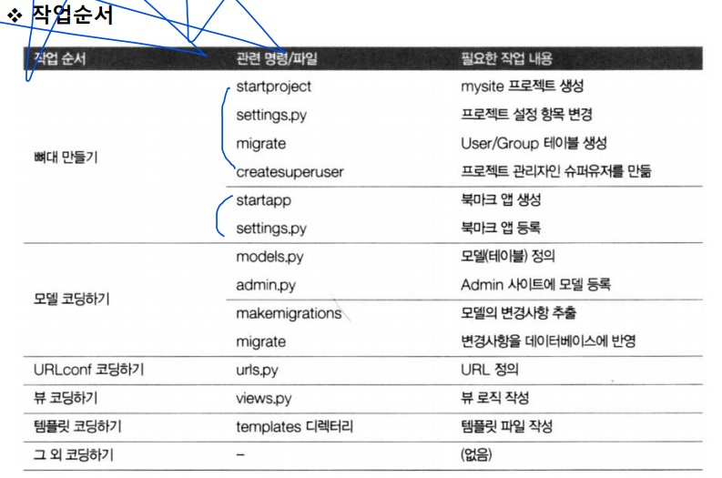
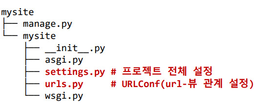

# 5. 실전 프로그램 개발 - Bookmark App

이제 앱들을 만들어 보자 야호!!!!ㅜㅠㅏㅑ!!!!

## 1) 작업순서

- 프로젝트 뼈대 만들기
  - migrate, migration을 통해 필수 파일 만들기'
- 모델 코딩하기
  - 테이블 관련 사항 개발
  - models.py, admin.py 설정하기 (어떤 column을 뽑아서 구성할껀지!! 가 중요함)
- URLconf 코딩하기
  - mysite와 app사이의 부모자식 urls.py 관계설정, view관계 설정, setting.py 설정!
  - urls.py 세팅과 setting.py가 거의 주력임, 앱이름 넣기 등
- view 코딩하기 , 자식 urls.py 채워넣기
  - Class를 통해 보이는거 개발
  - 애플리케이션 로직 개발
  - views.py
- 템플릿 코딩하기
  - 화면 UI 개발
  - teplates/ 디렉토리 하위의 html 파일들

- 이후, 뭐 base_html 만드는거 이런거는 선택사항이니 하고싶으면 하기

- Setting.py 주요사항
  - 프로젝트 설정 파일
  - 필수 항목
    - 데이터베이스 설정
    - 애플리케이션 등록
    - 템플릿(TEMPLATES) 항목 설정
    - 정적 파일 항목(STATIC_URL) 설정
    - 타임존 지정 등


## 2) 로직설계

- 처리 흐름받아서 설계하며 
- 로직 : URL을 받아 최정 HTML 템플릿 파일을 만든다.
  - /bookmark/  --> BookmarkLV.as_view()  ---> bookmark_list.html
  - /bookmark/99/ ---> BookmarkDV.as_view() ---> bookmark_detail.html
- URL 설계
  - URLconf 코딩에 반영
  - urls.py 파일
  - **URL 패턴, 뷰 이름, 템플릿 파일 이름 및 뷰에서 어떤 제너릭 뷰를 사용할지 결정**




## 3) 프로젝트 만들기

- 가상환경에서 이제 실제 web2 폴더를 만들것이다. 
- **`django-admin startproject mysite`**를 명령창에 쳐서 mysite폴더를 만든다. 이름을 web_app2로 바꿔준다  제일 위에 디렉토리는 web_app2로 바뀌게된다



### a) 프로젝트 뼈대 만들기

```python
import os
# Build paths inside the project like this: BASE_DIR / 'subdir'.
BASE_DIR = Path(__file__).resolve().parent.parent


# SECURITY WARNING: keep the secret key used in production secret!
SECRET_KEY = '54hbz^ki9)a5#7g264gn3y9m8!!xh_53i*q#4#9^or)8_*w5qi'

# SECURITY WARNING: don't run with debug turned on in production!
DEBUG = True

ALLOWED_HOSTS = ['172.30.1.58', '127.0.0.1','localhost']


# Application definition

INSTALLED_APPS = [
    'django.contrib.admin',
    'django.contrib.auth',
    'django.contrib.contenttypes',
    'django.contrib.sessions',
    'django.contrib.messages',
    'django.contrib.staticfiles',
    'bookmark.apps.BookmarkConfig', # 추가 or bookmark
    'blog.apps.BlogConfig', # 추가 
]
.
.
.

ROOT_URLCONF = 'mysite.urls'  # 이정보로 url을 계층화 시켜 사용하겠다는 뜻

TEMPLATES = [
    {
        'BACKEND': 'django.template.backends.django.DjangoTemplates',
        'DIRS': [],
        'APP_DIRS': True,
        
    }
    .
    .
    .
DATABASES = {
	'default': {
        'ENGINE': 'django.db.backends.mysql',
        'NAME': 'django_ex_db',  # 데이터베이스명
        'HOST': 'localhost',    # 서버 IP
        'PORT': '3306',         #포트 번호
        'USER': 'webuser',      # 사용자 ID
        'PASSWORD': '123456'    # 비밀번호
    }
}
    
LANGUAGE_CODE = 'ko-kr'    #지역 코드 시간 표시
TIME_ZONE = 'Asia/seoul'
USE_I18N = True
USE_L10N = True
USE_TZ = True

STATIC_URL = '/static/'   # 정적파일 URL # 실제 절대경로 표시
STATICFILES_DIRS = [os.path.join(BASE_DIR, 'static')]

MEDIA_URL = '/media/'  # 파일 업로드 url     # 실제 절대경로 표시
MEDIA_ROOT = os.path.join(BASE_DIR, 'media')
```

- mysql 연동 라이브러리 설치 필요하니깐
- pip install mysqlclient 설치하고 F1 눌러서 data 불러오면 된다! sql exlplore에서!

- urls.py 에서

```python
from django.contrib import admin
from django.urls import path

urlpatterns = [
	path('admin/', admin.site.urls),
]
```

 - admin/
   	- 관리자 페이지를 django가 자동으로 생성해줌
- urlpatterns
  - 처리할 url 목록을가짐
- path(<url문자열 ,>, <뷰함수,>,[name] ) 구조를가짐


- 이제 진정 model과 admin에서 만든 뼈대를 사용해 기본 테이블 생성함!
- $**python manage.py migrate** 명령어 입력
- $**python manage.py createsuperuser** 입력후 아이디 이메일 비번 설정 하면

- Django 홈페이지 생성되며 $**python manage.py runserver**로 로그인 할 수 있다. 
- 이러면 준비가 다된거고 여기서 app을 하나씩 만들어 가면된다.


## 4) bookmark 어플리케이션 만들기!

- 항상 models 만들고! admin만들고  ===>> urls 손보기, view 손보기, html손보기 끗

- python manage.py startapp bookmark    으로 bookmark 앱과 어플리케이션 디렉토리를 생성한다
- 이때 --init--.py 패키지를 정의해주는것임!

- bookmark/apps.py 에서 어플리케이션 구성에서 자동으로 이름생성됨

```python
from django.apps import AppConfig

class BookmarkConfig(AppConfig):
	name = 'bookmark'
```

- mysite/settings.py 에 앱 이름을 추가한다.

```python
INSTALLED_APPS = [.
                  .
                  .
                  'bookmark.apps.BookmarkConfig', # 추가 
]
```


- bookmark/models.py
  - 클래스명(bookmark)
    - 실제 테이블명(<앱명칭,>___<클래스명,>s)
      - bookmark_bookmarks
  - `__str__`(self)
    - 모델 인스턴스의 출력 문자열
      - print(model)을 사용했을 때 출력할 문자열

```python
from django.db import models

# Create your models here.

class Bookmark(models.Model):		# id로 자동생성된다. black=ture 는 space 공간 허용
    title = models.CharField('TITLE', max_length=100, blank=True)
    url =models.URLField('URL',unique=True) # 만들면 Bull 허용X

    def __str__(self):
        return self.title
```

- bookmark/admin.py  --> 저장한 모델(테이블)을 admin 사이트에 보이도록 등록

```python
from django.contrib import admin

# Register your models here.
from bookmark.models import Bookmark

@admin.register(Bookmark)
class BookmarkAdmin(admin.ModelAdmin):  # 상속받는다
    list_display = ('id','title','url') # 사이트에서 출력할 컬럼 목록
```

- **이전 mysite에서 구상한 model과 admin으로 실제 빈 테이블을 만들듯이**
- **이번엔 bookmark에서 똑같은 방법으로 migrate들을 이용해 채우는 테이블을 만들게된다.** 
- $ `python manage.py makemigrations bookmark`
- $`python manage.py migrate` 을 통해서 값을 채워넣어주면 이제 `python manage.py runserver` 하면 /admin/ 홈페이지에 입력한  bookmark의 생성된 column들이  나타남


------


- 이제 view, url, html 관리해보자

- bookmark/views.py

```python
from django.shortcuts import render

# Create your views here.
from django.views.generic import ListView, DetailView
from bookmark.models import Bookmark

class BookmarkLV(ListView):
    model = Bookmark

class BookmarkDV(DetailView):
    model = Bookmark
```

- **뷰에 대한 지식들**

  - **context : 뷰에서 템플릿으로 전달하는 사전!!**

    - 이 사전에 저장된 키(context 변수) - 값 쌍을 템플릿에서 이용
      - object_list :  ListView에서 넘겨주는 컨텍스트 변수
      - object: DetailView에서 넘겨주는 컨텍스트 변수

  - 컨텍스트 변수의 출력

    - {{변수명}}

  - 루프 블록

    - 

      ...

      {% endfor}

- **디폴트 템플릿 파일 경로! 및 검색순서**

  - ListView
    - templates/<앱명칭>/모델명_list.html     (모델명 소문자)
  - DetailView
    - templates/<앱명칭>/모델명_detail.html
  - tempate_name 필드 재정의하여 변경가능

- 템플릿 파일 경로 검색 순서

  - settings.py에 정의된
    - TEMPLATES.DIR    ( 에서 먼저 찾고)
    - INSTALLED_APPS 에 등록된 앱경로


- bookmark/templates/bookmark/bookmark_list.html
  - url 블록: 리으 url 생성
    - 
      - 현재 url : http://localhost:8000/bookmark
      - 값 : 1 
      - 생성 url : http://localhost:8000/bookmark/1

```html
<div>
    <h1>Bookmark List</h1>
    <div>
        <h1>{{bookmark.title}}</h1>
        <ul>
            <li>URL : <a href="{{bookmark.url}}" target="_blank">
                    {{bookmark.url}}</a></li>
        </ul>
    </div>
    <a href="">목록으로</a>
</div>
```

- bookmark_detail.html

```html
<div>
    <h1>Bookmark List</h1>
    <ul>
        
    <li>
            <a href="">
        {{bookmark}}</a>
    </li>
    
    </ul>
</div>
```

- 다 했으면 이제 bookmarks/urls.py에 저장해준다.! 이것들은 mysite/urls.py의 자식이 된다.

```python
from django.urls import path
from bookmark.views import BookmarkLV, BookmarkDV

app_name = 'bookmark' # 해당 어플의 네임스페이스명

urlpatterns = [
    path('', BookmarkLV.as_view(), name='index'),
    path('<int:pk>/', BookmarkDV.as_view(), name='detail'),
]

```

