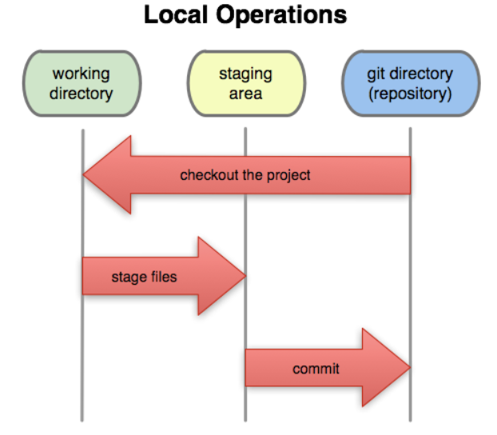
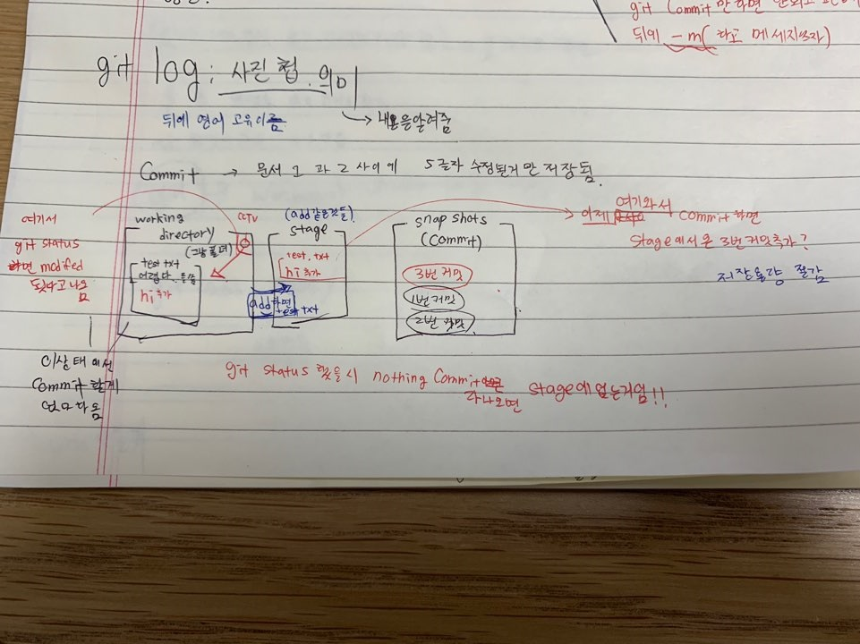

# git의 기초

## 1. git란?

- vcs version의 관리 system이다. 
-  version 의 구성에서 폴더(directory), 저장소(repository)를 이용해 문서 편집을 용이하게함(VCS)
- 많은 수정본을 만드는 용량을 획기적으로 줄이는 역할이라고 생각

## 2. git의 기본 구성

- 다음 그림에서 resository 는 repo와 commit 더미와 같은말이다.

### a. working directory

- `git mkdir dirname`  혹은,  `git touch filename` 을 통해 파일을 만든다.

- 빈 폴더라고 생각하며 앞으로 commit들이 되는 후보 파일들이 존재함
- `git status`라는 CCTV를 이용해 파일들의 변화 여부를 파악할 수 있는 구역
- 이 영역에서는 commit을 해도 넘어가지 인지하지 못하는 부분 ( Untracking이다 아직)

### b. Stage

- `git add. File/dirname` 를 이용해 Stage 위에 a에 있던 수정된 요소들이 올라간다.
- 여러개의 수정된 file 을 stage위에 올리는 부분이다.

	### c. Commit(Snapshot)

- stage에 오른 추가 내용들이 실제 file에 저장되는 곳임.

- `git commit -m 'N번째 커밋'` 이라는 명령어로 stage위의 자료들을 저장함

- stage에 있지않고 working directory의 추가 입력들은 commit할 수없다는 알림창과 add를 하라는 신호를 줌

  

- 이렇게 여러차례 commit을 통해 추가되고 비로써 file/dir은 Tracking이 가능해진다. 수정 전이라면 수정 전까지의 
  내용만 Tracking 할 수 있다.

## 3.  명령어 정리

| 형태                                     | 역할                                                   |
| ---------------------------------------- | ------------------------------------------------------ |
| `mkdir`                                  | 디렉토리 생성                                          |
| `touch`                                  | 파일 생성                                              |
| `cd(~/./..)`                             | 사용자, 하위, 상위파일 접근                            |
| `ls / ls -a`                             | 어떤 file,Dir이 있는지 보여줌                          |
| `rm / rm -r`                             | 제거하거나 없앰                                        |
| `mv`                                     | 이동하게함                                             |
| `git config --global user.name"이름"`    | 사용자 이름설정                                        |
| `git config --global user.email"이메일"` | 메일 설정                                              |
| `git init`                               | 초기화 파일을 만듬                                     |
| `git status`                             | 현재 상태 파악                                         |
| `git log`                                | 내용 알려줌(사진첩)                                    |
| `git add<file/dirname>`                  | stage에 올려주는 역할                                  |
| `git commit -m 'N번째 커밋'`             | 사진찍는 역할 (Tracking 가능해짐)                      |
| `git restore <file/dirname>`             | 이전 상태로 복구해줌(commit 된 이후 저장된 것들 기준!) |

## 4. CLI 문서편집기 vim 

| `vim 파일명` | 파일에 직접 편집함 |
| ------------ | ------------------ |
| `i`          | insert(편집)모드   |
| `esc`        | 명령모드           |
| `:w`         | 저장               |
| `:q`         | 종료               |
| `:wq`        | 저장 및 종료       |
| `:q!`        | 강제종료           |

## 5. 기타 및 주의사항

- restore은 한번 쓰면 되돌릴 수 없기에 자주 쓰지않는 것이 좋다
- init을 하되면 (master) 마크가 생기며 저장소 안에 보이지 않는 .git/ 파일이 존재한다. 
- 항상 작업전 init을 하는 습관을 갖자! 듀얼이 되서 이상해질 수 있다.
- untracked / tracking / unmodified / modified / staged
- 여러개 file을 stage에 올리고 commit을 하면 같은 커밋 더미에 올라가게 된다.
- $의 의미란 명령을 받을 준비가 되있는 것이다.
- log 길이가 너무 길면 stock이 발생할 수 있는 데 q를 누르면 빠져나올 수 있다.
- `git add dir/filename && git commit -m 'dir/filename'` 을 하면 동시에 staging과 commit을 할 수 있다.
- `git add 파일명 파일명 파일명` ,  `git commit 파일명 파일명` 을 하면 여러개를 한번에 할 수있다.

 

- 

  수업시간때 기록한 것